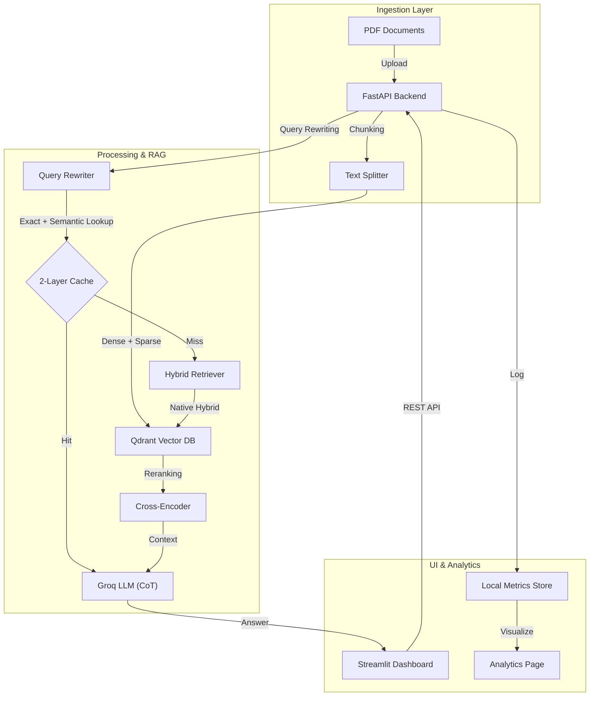

<div align="center">
  

  <h1>InvenioAI — Advanced RAG for Document Q&A</h1>
  <p><b>Hybrid Search, RAG Fusion, and Chain-of-Thought (CoT) Reasoning.</b></p>

  [](https://www.python.org/downloads/)
  [](https://fastapi.tiangolo.com/)
  [](https://streamlit.io/)
  [](https://qdrant.tech/)
  [](https://groq.com/)
  [](https://opensource.org/licenses/MIT)
</div>

A high-performance, hybrid-retrieval RAG system for document Q&A over PDFs. Combines dense + sparse (BM42) search, RAG Fusion multi-query expansion, cross-encoder reranking, and Chain-of-Thought reasoning to answer questions grounded in cited source context.

<div align="center">
  <kbd>
    <video src="https://github.com/user-attachments/assets/7b03817b-30d7-4285-b24a-679797983aa7" width="100%" controls autoplay loop muted playsinline style="border-radius: 8px; box-shadow: 0 10px 30px rgba(0,0,0,0.15);">
      Your browser does not support the video tag.
    </video>
  </kbd>
  <p><i>Interactive demo: hybrid retrieval, reranking, and multi-stage reasoning.</i></p>
</div>

**Live demo:** [felixhrdyn-invenioai.hf.space](https://felixhrdyn-invenioai.hf.space)

---

## Overview

Extracting precise answers from large PDF collections usually forces a trade-off between naive single-vector search (misses lexical matches, term-specific queries) and heavyweight reranking pipelines that are too slow for interactive use. InvenioAI bridges this by combining:

- **Native hybrid retrieval:** Dense (MMR) + sparse (BM42) search, fused server-side in Qdrant.
- **RAG Fusion:** Multi-query expansion to capture diverse phrasings of the same intent.
- **Cross-encoder reranking:** FlashRank (`ms-marco-MiniLM-L-12-v2`) re-scores top candidates before they reach the LLM.
- **Structured CoT reasoning:** A 4-step protocol (deconstruction, filtering, synthesis, strategy) grounds answers in retrieved context instead of the model's own priors.
- **2-layer semantic cache:** Exact-match + embedding-similarity cache to skip redundant retrieval/generation on repeated or paraphrased queries.

---

## Quick Start

### 1. Setup

```bash
python -m venv venv
source venv/bin/activate        # venv\Scripts\activate on Windows
pip install -r requirements.txt
cp .env.example .env            # set GROQ_API_KEY, LLAMA_CLOUD_API_KEY, etc.
```

### 2. Run

```bash
# Terminal 1: backend API
cd backend && uvicorn app.main:app --reload

# Terminal 2: Streamlit UI
streamlit run frontend/streamlit_app.py
```

Or run both together (mirrors the Hugging Face Space startup):

```bash
./start.sh          # Linux/Mac
run_local.bat        # Windows
```

### 3. Docker

```bash
docker build -t invenioai .
docker run -p 7860:7860 invenioai
```

A multi-container setup (backend/frontend/redis) is available via `docker-compose.yml`.

---

## Technical Features

### Ingestion & Document Processing
- **Running header/footer elimination:** Position-based boundary analysis that strips repetitive noise (page titles, section lines, page numbers) from long PDFs without touching structural content.
- **Structure-aware chunking:** `MarkdownHeaderTextSplitter` (H1-H3) combined with `RecursiveCharacterTextSplitter`, preserving document outline in vector payloads.
- **Cross-page context propagation:** Active header state machine that inherits and propagates parent headings onto continuation pages, preventing context starvation at retrieval time.

### Retrieval & Search
- **Hybrid search:** Dense semantic retrieval (MMR) + server-side sparse vector search (BM42), fused natively in Qdrant.
- **RAG Fusion:** Multi-query generation to widen retrieval coverage.
- **Advanced reranking:** Cross-encoder re-evaluation of top candidates via FlashRank before the LLM sees them.

### Logic & Intelligence
- **Chain-of-Thought reasoning:** 4-step structured protocol (deconstruction, filtering, synthesis, strategy) for grounded, traceable answers.
- **Semantic caching:** 2-layer strategy (exact match + cosine-similarity > 0.92) that skips redundant LLM calls for repeated or paraphrased queries.

### Core System & UX
- **Async job orchestration:** Background indexing with real-time status polling.
- **Analytics dashboard:** Retrieval-quality metrics (nDCG, HitRate, precision/recall/MRR), latency, and API usage.
- **Cloud-ready:** Single-image Docker build for Hugging Face Spaces / Azure Container Apps, plus a docker-compose split for local multi-container development.

---

## Technology Stack

### Backend
- **Framework:** FastAPI
- **RAG Engine:** LangChain
- **PDF Parser:** LlamaParse (high-fidelity Markdown extraction)
- **LLM:** Groq Cloud (default `openai/gpt-oss-20b`, configurable via `INVENIOAI_LLM_MODEL`)
- **Embedding Model:** `sentence-transformers/paraphrase-multilingual-MiniLM-L12-v2` (dense)
- **Sparse Model:** `Qdrant/bm42-all-minilm-l6-v2-attentions`
- **Reranker:** FlashRank (`ms-marco-MiniLM-L-12-v2` cross-encoder)
- **Caching:** DiskCache / Redis + NumPy cosine similarity

### Frontend
- **Framework:** Streamlit
- **Visualization:** Plotly, Pandas
- **Styling:** Vanilla CSS custom design system

### Infrastructure
- **Vector Database:** Qdrant (local / server / cloud)
- **Deployment:** Docker, GitHub Actions CI
- **Environment:** Python 3.12

---

## Architecture



---

## Performance & Limits

| Parameter | Value | Description |
| :--- | :--- | :--- |
| **Retrieval Mode** | Native Hybrid | Dense (MMR) + Sparse (BM42) |
| **Rerank Top-K** | 7 docs | Context window handed to the LLM |
| **Semantic Cache Threshold** | 0.92 cosine | Above this, a query is served from cache |
| **Avg. Retrieval** | ~2s | Multi-query hybrid search + fusion |

---

## Configuration

The application is configured via `.env` (see `.env.example` for the full list). Key variables:

- `GROQ_API_KEY` - required for LLM generation and query rewriting.
- `LLAMA_CLOUD_API_KEY` - required for PDF parsing during indexing.
- `QDRANT_URL` / `QDRANT_API_KEY` - optional; defaults to local storage at `backend/qdrant_data/`.
- `INVENIOAI_LLM_MODEL` - Groq model id (default `llama-3.1-8b-instant`).
- `INVENIOAI_ENABLE_HYBRID_SEARCH` - toggle dense+sparse mode (default `1`).
- `INVENIOAI_SEMANTIC_CACHE_THRESHOLD` - L2 cache similarity threshold (default `0.92`).
- `INVENIOAI_DELETE_UPLOADED_PDFS` - remove local PDFs after indexing (default `0`).

---

## License

MIT License. See [LICENSE](LICENSE) for details.
</content>
